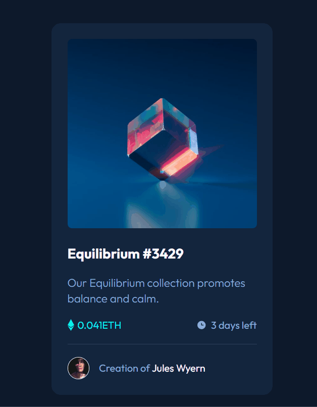

# Frontend Mentor - Solução do Componente de Cartão de Pré-visualização NFT

Esta é uma solução para o [desafio de componente de cartão de pré-visualização NFT no Frontend Mentor](https://www.frontendmentor.io/challenges/nft-preview-card-component-SbdUL_w0U). Os desafios do Frontend Mentor ajudam você a melhorar suas habilidades de codificação construindo projetos realistas.

## Índice

- [Visão Geral](#visao-geral)
  - [O desafio](#o-desafio)
  - [Captura de tela](#captura-de-tela)
  - [Links](#links)
- [Meu processo](#meu-processo)
  - [Construído com](#construido-com)
  - [O que aprendi](#o-que-aprendi)
  - [Desenvolvimento contínuo](#desenvolvimento-continuo)
- [Autor](#autor)
- [Agradecimentos](#agradecimentos)
- [Fique Ligado](#fique-ligado)

## Visão Geral

### O desafio

Os usuários devem ser capazes de:

- Ver o layout ideal dependendo do tamanho da tela do dispositivo
- Ver os estados de hover para elementos interativos

### Captura de tela



## Meu processo

### Construído com

- Marcação HTML5 semântica
- Propriedades customizadas do CSS
- Flexbox

### O que aprendi

Através desse projeto, pude melhorar e praticar a otimização do trabalho, focando no passo a passo para a resolução do projeto. Treinei o planejamento antes de mais nada, para traçar melhor um caminho a seguir. Consegui entender melhor a aplicação das pseudo-classes e pseudo-elementos e como são úteis no desenvolvimento front-end.

Neste exemplo, utilizo o pseudo-elemento para adicionar um ícone sobreposto à imagem principal do projeto. Num primeiro momento sem opacidade, e utilizo a pseudo-classe para adicionar opacidade e tornar o ícone visível ao passar o mouse por cima, como solicitado no estado ativo do projeto.

```css
.card .image-link::after {
    content: "";
    background: url(../images/icon-view.svg) no-repeat center;
    position: absolute;
    width: 100%;
    height: 100%;
    opacity: 0;
    transition: 0.3s ease-in-out;
}

.card .image-link:hover::after {
    opacity: 0.4;
}
```

### Desenvolvimento contínuo

A forma de utilização das pseudo-classes e pseudo-elementos foi muito interessante neste projeto e é algo muito importante no desenvolvimento front-end. Verifiquei que preciso estar sempre em constante evolução neste assunto. Ainda é preciso aperfeiçoar também o conhecimento e aplicação do Flexbox e Grid. Apesar de o Grid não ter sido utilizado neste projeto, percebo sua importância.

## Autor

- LinkedIn - [Vanderlei Junior](https://www.linkedin.com/in/vanderlei-oliveira94/)
- Frontend Mentor - [@Vanderlei94](https://www.frontendmentor.io/profile/Vanderlei94)
- GitHub - [@Vanderlei94](https://github.com/Vanderlei94)

## Agradecimentos

Agradeço aos professores do curso [Devemdobro](https://www.linkedin.com/company/dev-em-dobro/) que foram quem me auxiliaram com as dificuldades que passei neste projeto e orientaram a sua conclusão corretamente.

## Fique Ligado!

**Não paro por aqui! Em breve, novos projetos virão. Nos vemos nos próximos desafios! 🚀😊**

